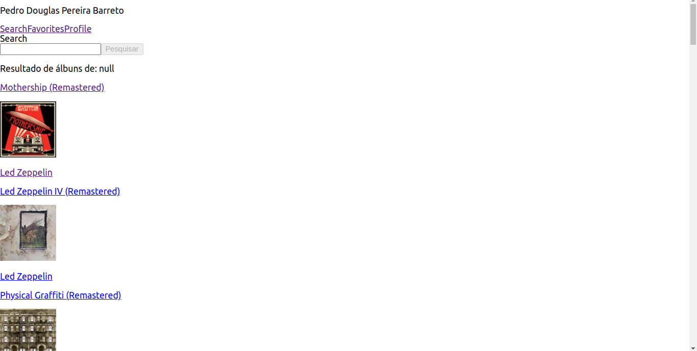

# Projeto Trybetunes
## 📋 Descrição do projeto
Uma aplicação capaz de reproduzir músicas das mais variadas bandas e artistas. Consumindo APIs de músicas e bandas do iTunes.

## 📷 Screenshot

## 💻 Tecnologias utilizadas
- [React](https://reactjs.org/)
- JavaScript
- Fecth API
- ES6
- ESLint
- NPM
- Git

## 🎓 Aprendizados
- Fazer requisições e consumir dados vindos de uma `API`;
- Utilizar os ciclos de vida de um componente React;
- Utilizar a função `setState` de forma a garantir que um determinado código só é executado após o estado ser atualizado
- Utilizar o componente `BrowserRouter` corretamente;
- Criar rotas, mapeando o caminho da URL com o componente correspondente, via `Route`;
- Utilizar o `Switch` do `React Router`
- Usar o componente `Redirect` pra redirecionar para uma rota específica;
- Criar links de navegação na aplicação com o componente `Link`;

## 📈 Status do projeto
✅ Concluído

## 🚀 Links
- Site no ar: [Link](https://trybetunes-psi.vercel.app/)

## :busts_in_silhouette: Contribuintes
<table>

<tr  style="width:120px">

<td  align="center">

<a  target=”_blank”  href="https://github.com/Dogl4">

 

<b>Pedro Barreto</b>

</a>

</td>

</tr>

</table>
